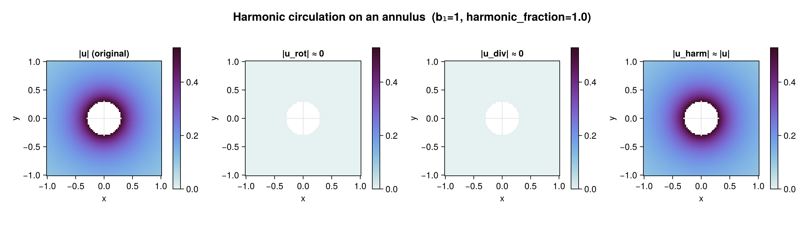
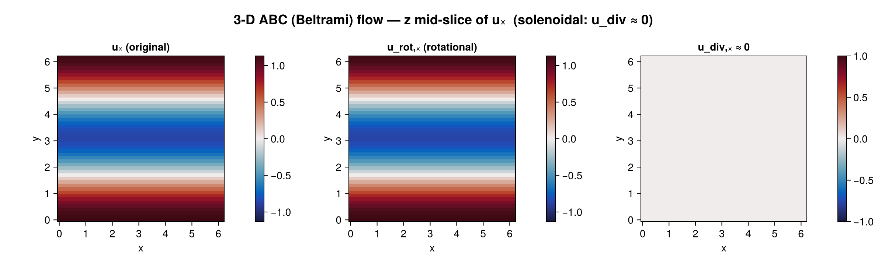
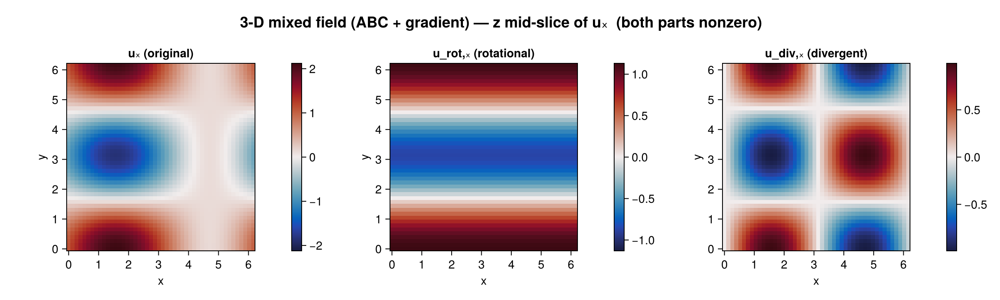
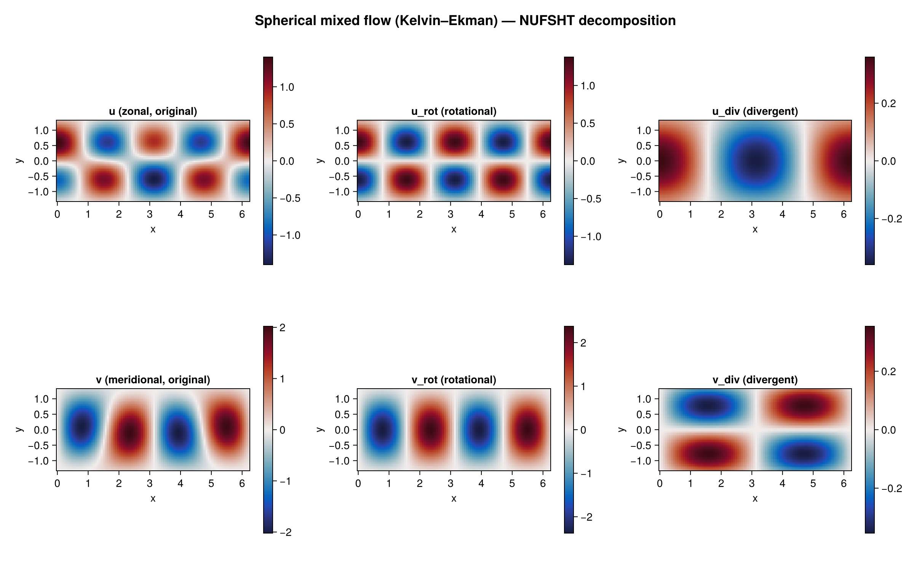

# HelmholtzDecomposition.jl

Helmholtz–Hodge decomposition of velocity fields into **rotational** (divergence-free),
**divergent** (curl-free), and **harmonic** components — in **1D/2D/3D and generically N-D**,
on Cartesian and spherical grids, on **CPU and GPU**, with serial / threaded / distributed /
MPI execution backends.

```
u  =  u_div (∇χ)  ⊕  u_rot (rot R)  ⊕  u_harm
```

- **u_div** is curl-free, from the scalar velocity potential `χ` (`Δχ = ∇·u`).
- **u_rot** is divergence-free, from the rotation potential `R` (`ΔR_ab = ∂_a u_b − ∂_b u_a`);
  in 2D the single component is the streamfunction `ψ`, in 3D the Hodge dual of the vector
  potential `A`, and in N-D an antisymmetric matrix with `N(N−1)/2` components
  (Glötzl & Richters 2023).
- **u_harm** is the harmonic remainder (both div- and curl-free), nonzero on bounded /
  multiply-connected domains (islands, holes), where it carries the circulation/flux that no
  single-valued potential can represent.

## Why This Package Exists

On the sphere, filtering velocity Cartesian components **does not commute** with differential operators (Aluie 2019, eq. 38). The correct approach — mathematically equivalent to the generalized convolution that **does** commute (Proposition 2) — is to filter the scalar Helmholtz potentials (ψ, χ) separately.

Then for coarse-graining: filter ψ̄, χ̄ as scalars → reconstruct velocity from filtered potentials.

### Taylor-Green Vortex (purely rotational → divergent component ≈ 0)


### Vortex + Source (mixed rotational and divergent)


### Point Source (purely divergent → rotational component ≈ 0)


### Harmonic circulation on an annulus (multiply-connected domain, issue #1)

A pure circulation around a masked hole is **harmonic** — `u_rot ≈ 0`, `u_div ≈ 0`, and the
whole field lands in `u_harm` (`harmonic_fraction ≈ 1`, `count_holes = 1`).



### 3-D ABC (Beltrami) flow (`z` mid-slice)

A fully solenoidal 3-D field: the rotational part recovers the original and the divergent
part vanishes.



### 3-D mixed field (`z` mid-slice)

A 3-D field with **both** components (solenoidal ABC + a gradient): the decomposition
splits `uₓ` into a nonzero rotational and a nonzero divergent part.



### Spherical mixed flow (Kelvin–Ekman, NUFSHT)

Decomposition on a longitude–latitude grid via the non-uniform spherical-harmonic
transform: a rotational core plus a smaller divergent (Ekman-like) part.



## Solver Extensions ⚠️

The base package includes only an iterative SOR solver (Red-Black Successive Over-Relaxation). While correct, it is **orders of magnitude slower** than spectral solvers for large grids.

**Load the appropriate extension for your geometry:**

| Geometry | Regular Grid | Irregular Grid |
|----------|-------------|----------------|
| **Cartesian (periodic)** | `using FFTW` | `using FINUFFT` |
| **Spherical** | `using FastSphericalHarmonics` | `using NUFSHT` |

The `AutoSolver()` (default) automatically picks the best loaded solver. If no spectral extension is loaded, it falls back to SOR with a `@debug` message.

## Quick Start

```julia
using HelmholtzDecomposition: HelmholtzDecomposition as HD
using FFTW: FFTW  # load a spectral extension

grid = HD.StructuredGrid(HD.CartesianGeometry(1000.0, 1000.0),
                         collect(0.0:1000.0:99000.0), collect(0.0:1000.0:99000.0))

# Physical-space decomposition (mask/BC-aware; SOR or spectral Poisson solve)
result = HD.helmholtz_decompose(u, v, grid)

# Or the fast spectral path (returns physical fields via inverse transform)
result = HD.helmholtz_decompose_spectral(u, v, grid)

# Velocity-like fields use a component-last layout (dims..., N):
result.u_rot          # rotational (divergence-free) velocity, (Nx, Ny, 2)
result.u_div          # divergent (curl-free) velocity
result.u_harm         # harmonic remainder
result.χ              # scalar velocity potential
HD.streamfunction(result)   # ψ (2D); HD.vector_potential(result) in 3D
result.harmonic_fraction    # ‖u_harm‖ / ‖u‖ — how much lives in the harmonic subspace
```

### N-dimensional, GPU, and batch

```julia
# 3-D: pass a single component-last array (Nx, Ny, Nz, 3)
res3 = HD.helmholtz_decompose_spectral(U3, grid3)
A1, A2, A3 = HD.vector_potential(res3)

# GPU: pass a CuArray (requires `using CUDA`); AutoBackend routes to the CUFFT path
res_gpu = HD.helmholtz_decompose_spectral(CUDA.cu(U), grid)

# Batch many snapshots in parallel (ThreadedBackend / DistributedBackend / MPIBackend)
results = HD.helmholtz_decompose_batch(grid, fields; backend = HD.ThreadedBackend())
```

### Scattered / unstructured data

For data sampled at arbitrary point locations (not a grid — observation networks, floats,
tracks), use `ScatteredPoints`. It routes through the non-uniform transforms: an accurate
inverse NUFFT (conjugate-gradient least-squares, not the naive adjoint) → exact Leray
projection → synthesis back to the points.

```julia
using FINUFFT: FINUFFT
pts = HD.ScatteredPoints(HD.CartesianGeometry(1.0, 1.0), X; box = (Lx, Ly))   # X is (M, 2)
res = HD.helmholtz_decompose_spectral(U, pts)   # U is (M, 2) → (; u_rot, u_div, u_harm)
```

Scattered **Cartesian** (FINUFFT) is fully supported and accurate for arbitrary point sets.
Scattered **spherical** (NUFSHT) is not yet available — it needs vector/spin-weighted
spherical-harmonic synthesis and a public scattered adjoint from NUFSHT (tracked upstream);
it raises a clear error rather than returning an approximation. Structured spherical grids
are fully supported.

### Multiply-connected domains (the harmonic part)

```julia
mask = HD.disk_mask(grid; radius = 0.3)               # an annulus / domain with an island
grid = HD.StructuredGrid(geom, xs, ys; mask = mask)
HD.count_holes(grid)                                  # 1  (b₁ of the active region)
res = HD.helmholtz_decompose(u, v, grid)
res.harmonic_fraction                                 # ≈ 1 for a pure circulation about the hole
```

## Mathematical Formulation

The Helmholtz decomposition expresses any 2D vector field as:

**u** = **u**_rot + **u**_div

where:
- **u**_rot = ∇ × (ψ ẑ) is non-divergent (∇ · **u**_rot = 0)
- **u**_div = ∇χ is irrotational (∇ × **u**_div = 0)

The scalar potentials are found by solving:
- ∇²ψ = ζ (vorticity = ∂v/∂x − ∂u/∂y)
- ∇²χ = δ (divergence = ∂u/∂x + ∂v/∂y)

On the sphere (radius R):
- ∇²ψ = ζ → eigenvalue −ℓ(ℓ+1)/R²
- u_rot = −(1/R) ∂ψ/∂φ, v_rot = 1/(R cos φ) ∂ψ/∂λ

## When is Helmholtz Required?

- **NOT needed:** Non-divergent velocity (e.g., SSH-derived geostrophic flow) — Storer et al. (2022)
- **REQUIRED:** Full model velocity with both rotational AND divergent components
- **ALSO needed:** Separating energy flux Π into toroidal/potential contributions — Buzzicotti et al. (2023)

## Two backend axes

The package keeps two orthogonal axes separate:

**Spectral / Poisson solver** (the math), selected by `AutoSolver()` or passed explicitly:

| Solver | When to use |
|--------|-------------|
| `SORSolver` (base, dimension-generic) | masked domains, non-periodic BCs, small grids |
| `CartesianSpectralSolver` (FFTW) | regular periodic Cartesian, any dimension |
| `CartesianNUFFTSolver` (FINUFFT) | irregular/scattered 2-D Cartesian |
| `SphericalSpectralSolver` (FastSphericalHarmonics) | Clenshaw–Curtis lat/lon (`Nlon = 2·Nlat−1`) |
| `SphericalNUSHTSolver` (NUFSHT) | arbitrary / scattered spherical grids |

`AutoSolver` is mask-aware (never picks a periodic spectral solver on a masked domain) and
prefers the regular FFT/SHT on structured grids.

**Execution backend** (where/how arrays compute): `SerialBackend`, `ThreadedBackend`
(`using OhMyThreads`), `GPUBackend` (`using CUDA`), `DistributedBackend` (`using Distributed`),
`MPIBackend` (`using MPI`). Passed via `backend=` to `helmholtz_decompose` /
`helmholtz_decompose_batch`; `AutoBackend()` infers it from the array type.

## Relationship to Structure Function "Helmholtz Decomposition"

This package performs **spatial** Helmholtz decomposition (Poisson solver). This is distinct from:
- **Lindborg (2015) integral relations** used in `StructureFunctions.jl` for decomposing D_LL, D_TT → D_rot, D_div via cumulative integrals (no Poisson solver needed).

These are two completely different operations that happen to share the name "Helmholtz decomposition."

## References

- **Aluie (2019)**: doi:10.1007/s13137-019-0123-9 — Convolutions on the sphere; Proposition 2 proves Helmholtz filtering commutes with ∇
- **Buzzicotti, Storer, Khatri, Griffies, Aluie (2023)**: doi:10.1126/sciadv.adi7420 — Global kinetic energy cascade using Helmholtz filtering
- **Storer et al. (2022)**: doi:10.1038/s41467-022-33031-3 — When Helmholtz is not needed (non-divergent fields)
- **Lindborg (2015)**: doi:10.1017/jfm.2014.685 — SF integral relations (different "Helmholtz")
- **Berlinghieri et al. (2023)**: doi:10.1029/2022GL097713 — GP Helmholtz for ocean currents

## See Also

- [ImmersedLayers.jl](https://juliaibpm.github.io/ImmersedLayers.jl/stable/manual/helmholtz/) — Alternative Helmholtz implementation using lattice Green's functions
- [FlowSieve](https://flowsieve.readthedocs.io/) — C++ coarse-graining toolkit with Helmholtz mode
