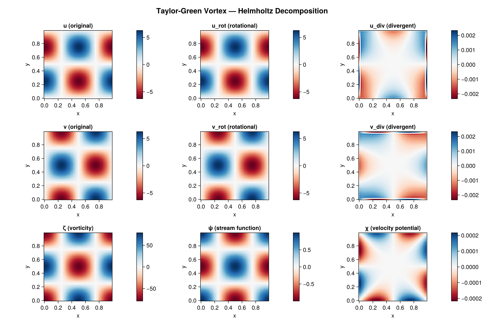
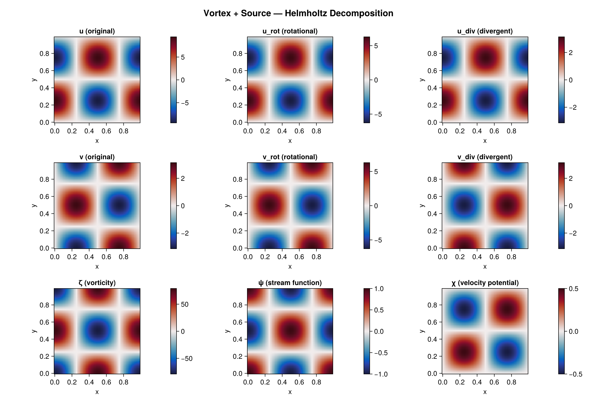
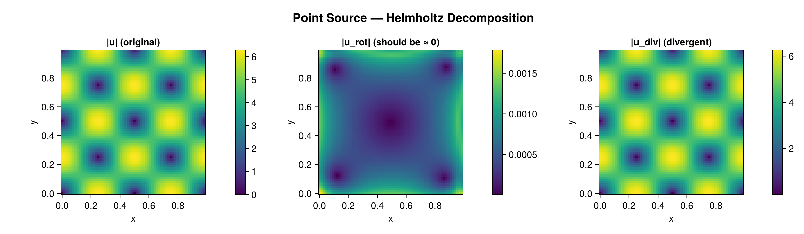

# Examples

## Visual Results

### Taylor-Green Vortex (purely rotational)



### Vortex + Source (mixed rotational and divergent)



### Point Source (purely divergent)



Velocity-like result fields use a component-last layout `(dims..., N)`; index the last
axis (or use `cat(u, v; dims=3)` to build inputs). Runnable scripts live in `examples/`.

## Cartesian: Pure Rotational Field (Taylor-Green Vortex)

```julia
using HelmholtzDecomposition: HelmholtzDecomposition as HD
using FFTW: FFTW

N = 64; L = 1.0; dx = L / N
grid = HD.StructuredGrid(HD.CartesianGeometry(dx, dx),
    collect(range(0.0, L - dx, length=N)), collect(range(0.0, L - dx, length=N)))

u, v, = HD.taylor_green_vortex(grid)
result = HD.helmholtz_decompose_spectral(u, v, grid)   # FFTW spectral → physical fields

@assert maximum(abs.(result.u_div)) < 1e-10            # divergent component ≈ 0
@assert result.harmonic_fraction < 1e-8
```

## Cartesian: Mixed Rotational + Divergent

```julia
u, v, = HD.rankine_vortex_with_source(grid)
result = HD.helmholtz_decompose_spectral(u, v, grid)
U = cat(u, v; dims = 3)

@assert maximum(abs.(result.u_rot)) > 0.01 && maximum(abs.(result.u_div)) > 0.01
@assert maximum(abs.(result.u_rot .+ result.u_div .+ result.u_harm .- U)) < 1e-10
```

## 3-D: ABC (Beltrami) Flow

```julia
# U3 is a component-last (Nx, Ny, Nz, 3) array on a 3-D grid
res3 = HD.helmholtz_decompose_spectral(U3, grid3)
A1, A2, A3 = HD.vector_potential(res3)   # the 3-D vector potential
```

## Spherical: Rossby Wave (Non-divergent)

```julia
grid = HD.StructuredGrid(HD.SphericalGeometry(6.371e6),
    collect(range(0.0, 2π - 2π/128, length=128)), collect(range(-π/3, π/3, length=64)))
u, v, = HD.rossby_wave(grid)
result = HD.helmholtz_decompose(u, v, grid)   # SOR (load FastSphericalHarmonics/NUFSHT for spectral)
```

## Coarse-Graining Workflow

```julia
result = HD.helmholtz_decompose(u, v, grid)

# Filter the scalar potentials (use your filtering package) — this is what commutes with ∇.
ψ_filtered = your_filter(HD.streamfunction(result), grid, filter_scale)
χ_filtered = your_filter(result.χ, grid, filter_scale)

# Reconstruct velocity from the filtered potentials.
```
