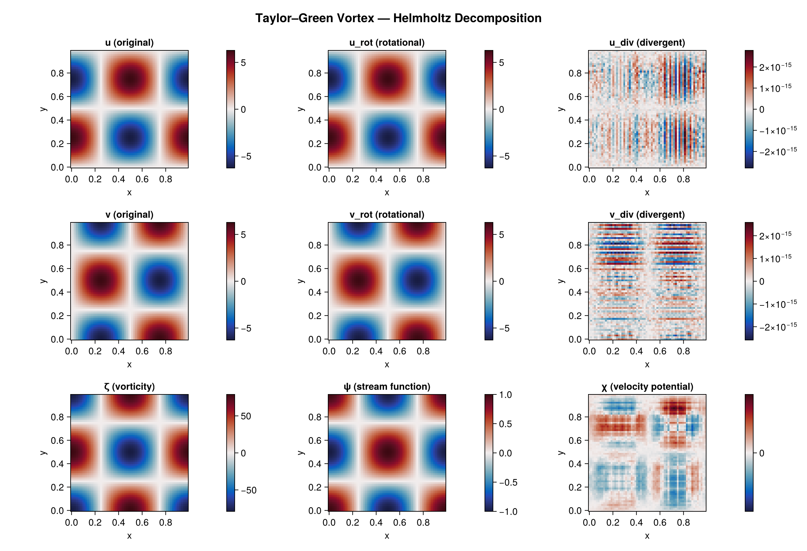
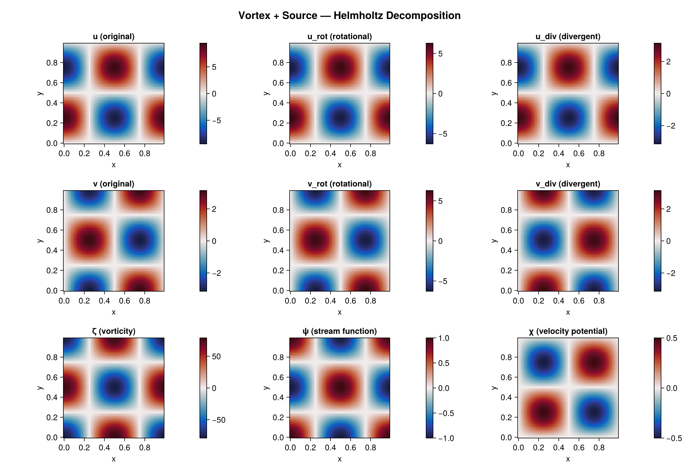
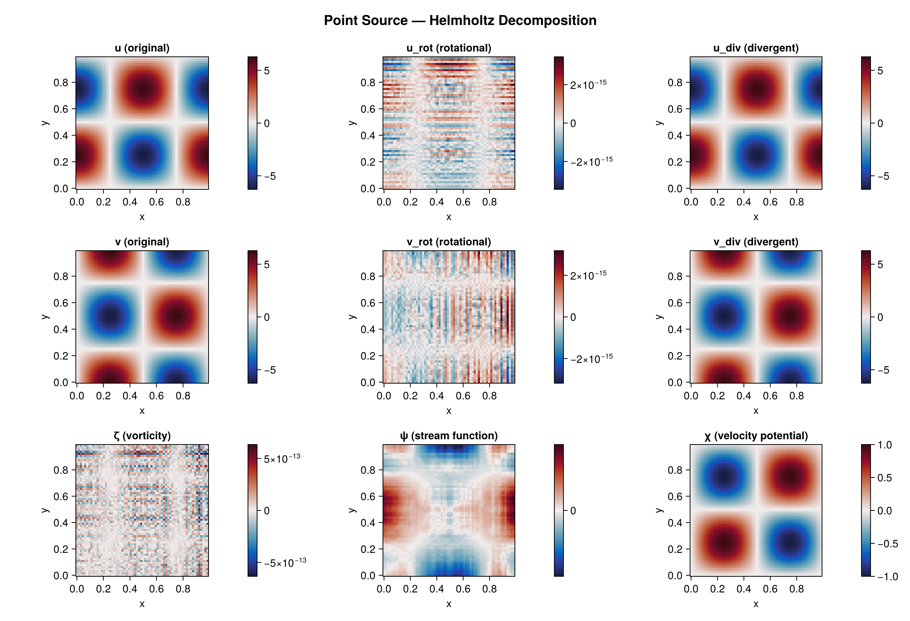
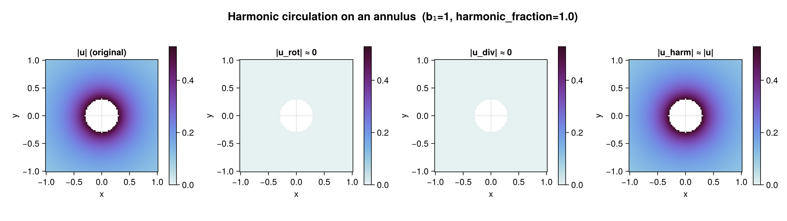
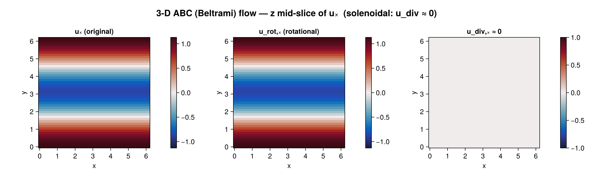
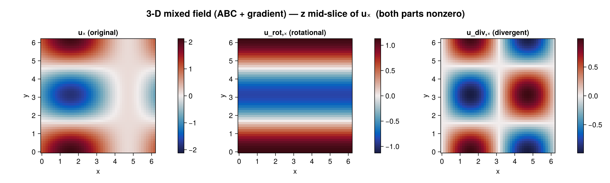
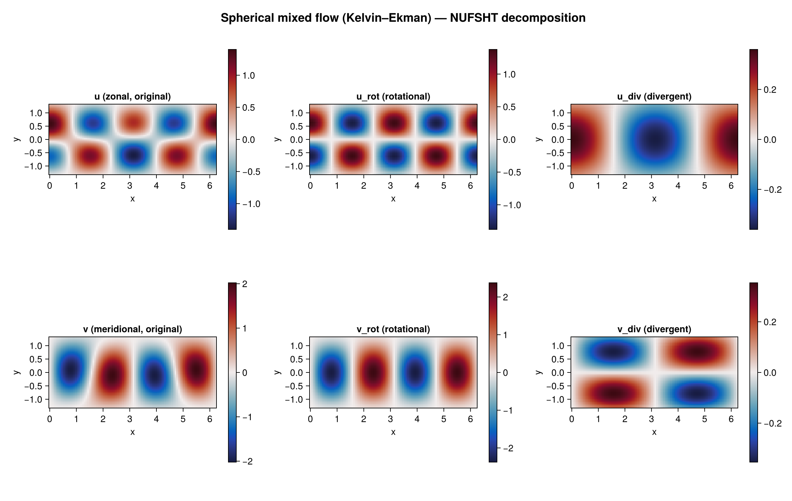

# Examples

## Visual Results

### Taylor-Green Vortex (purely rotational)



### Vortex + Source (mixed rotational and divergent)



### Point Source (purely divergent)



### Harmonic circulation on an annulus (multiply-connected)



### 3-D ABC (Beltrami) flow — `z` mid-slice



### 3-D mixed field — `z` mid-slice



### Spherical mixed flow (Kelvin–Ekman, NUFSHT)



Velocity-like result fields use a component-last layout `(dims..., N)`; index the last
axis (or use `cat(u, v; dims=3)` to build inputs). Runnable scripts live in `examples/`.

## Cartesian: pure rotational field (Taylor–Green vortex)

```julia
using HelmholtzDecomposition: HelmholtzDecomposition as HD
using FlowGeometries: FlowGeometries as FG
using FFTW: FFTW

N, L = 64, 1.0
axis = FG.Axes.UniformAxis(0.0, L / N, N)
grid = FG.Grids.StructuredGrid(FG.Geometry.CartesianGeometry{Float64}(), axis, axis;
                               topology = (true, true), period = (L, L))

U = cat(u, v; dims = 3)                 # component-last (dims..., N)
result = HD.helmholtz_decompose(U, grid)

@assert maximum(abs, result.u_div) < 1e-14      # divergent component ≈ 0
```

Uniformity is read from the axis TYPE, never by scanning values, so a `collect`ed axis is not
provably uniform and no direct transform applies to it. `UniformAxis` is also `isbits`, so a grid
built from one moves to a device for free.

The residue in `result.harmonic_fraction` on a smooth field is the two collocated↔staggered
averaging hops and falls at second order — `9.6e-3` at N = 32, `6.0e-4` at N = 128. It is
discretisation, not topology.

## Reusing a plan

`helmholtz_decompose(u, grid)` builds a plan, a workspace and a result and throws them away. For
more than one field on a grid, build them once — the steady-state call then allocates nothing.

```julia
plan = HD.plan_helmholtz(grid; boundary = HD.Neumann())
ws   = HD.allocate_workspace(plan)
res  = HD.allocate_result(plan)

for u in fields
    HD.helmholtz_decompose!(res, u, plan, ws)    # 0 bytes
end
```

## Batches

A `HelmholtzBatch` stores every output contiguously with the batch axis last, and `batch[b]` is a
result of views onto slice `b`.

```julia
using OhMyThreads: OhMyThreads            # enables ThreadedBackend
using ComputationalBackends: ComputationalBackends as CB

batch = HD.helmholtz_decompose_batch(plan, fields; backend = CB.ThreadedBackend())
size(batch.u_rot)        # (dims..., N, length(fields))
batch[3].harmonic_fraction
```

`Distributed` and `MPI` spread the same batch across processes or ranks. A backend that is named
but whose extension is not loaded throws; it is never quietly downgraded to serial.

## 3-D: ABC (Beltrami) flow

```julia
# U3 is component-last (Nx, Ny, Nz, 3)
res3 = HD.helmholtz_decompose(U3, grid3)
A1, A2, A3 = HD.vector_potential(res3)   # the 3-D vector potential
```

## Spherical: Rossby wave (non-divergent)

```julia
NLON, NLAT = 128, 64
λ = FG.Axes.UniformAxis(0.0, 2π / NLON, NLON)
φ = FG.Axes.UniformAxis(-π / 2 + π / (2NLAT), π / NLAT, NLAT)
grid = FG.Grids.StructuredGrid(FG.Geometry.SphericalGeometry(6.371e6), λ, φ;
                               topology = (true, false), period = (2π, nothing))

result = HD.helmholtz_decompose(cat(u, v; dims = 3), grid)
```

A lat–lon grid is not a transform's node set, so it takes the multigrid-preconditioned iterative
path. Load `FastSphericalHarmonics` for a Clenshaw–Curtis grid, or `NUFSHT` for any node set
covering the sphere. A *regional* patch stays on the iterative solver: spherical-harmonic analysis
integrates over all of `S²`, so a patch does not determine the solution even on the patch.

## Coarse-Graining Workflow

```julia
result = HD.helmholtz_decompose(cat(u, v; dims = 3), grid)

# Filter the scalar potentials (use your filtering package) — this is what commutes with ∇.
ψ_filtered = your_filter(HD.streamfunction(result), grid, filter_scale)
χ_filtered = your_filter(result.χ, grid, filter_scale)

# Reconstruct velocity from the filtered potentials.
```
